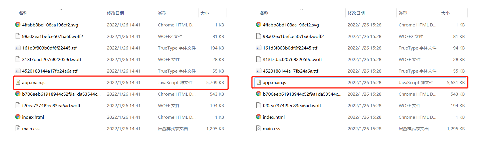

## 前端项目优化

### 前端工程构建工具

随着前后端分离以来，在一个项目开发的过程中，前端工程师需要维护的代码越来越庞大，代码维护、打包、发布等流程也变得极为繁琐，同时浪费的时间和精力也会越来越多。并且这些过程都是人工手动完成的，人为的错误也随着流程的增加而增加。在这种情况下，许多自动化前端构建工具也就诞生了。

比如：百度的 [fis](http://fis.baidu.com/)，以及 [Gulp](https://www.gulpjs.com.cn/)、[Grunt](https://www.gruntjs.net/)，以及后面我们在此次培训中主要用到的打包工具 [webpack](https://webpack.docschina.org/)。

这篇文档会主要讲在使用 webpack 构建前端项目中会用到的一些可以优化我们项目的地方，文档内容可能会有一些遗漏或错误的地方，欢迎大家补充和指正。

> 这篇文档会默认大家对 webpack 已经有了一定的了解。大家可以去[webapck 官网](https://webpack.docschina.org/)上查阅，也可以看我以前写的一篇文档[Webpack 基础](https://www.yuque.com/docs/share/a8498ebf-5a7f-4136-92b7-fb56063166ab?#)

### 项目打包

一般情况下，项目打包就是将我们项目中的文件合并压缩。但是在前端项目中我们又不能一味地让所有的文件全都合并成一个文件，那么这一个文件的体积就会非常大，加载慢而且还会出现加载失败的情况。所以我们在合并文件的基础上还得做好文件的拆分。

#### 文件合并与拆分

在 webpack 中，如果我们使用的是 webpack 默认配置的话，那么所有的 js 文件都会打包成一个文件。

```js
// webpack.config.js
// 后面出现的所有配置文件都是以此为基础进行增减

module.exports = {
  // 省略其他配置...
  entry: "./src/index.js",
  output: {
    filename: "app.[name].js",
    path: path.resolve(__dirname, "dist"),
  },
  // 省略其他配置...
};
```


我们可以看到 app.js 文件非常大，超过了 5M。这样的文件对于前端项目来说是一个巨大的风险，它会影响到我们项目的加载时间，甚至会出现在网络不好的情况下加载失败。

对于这种情况，我们一般会将文件拆分成小的文件，以方便浏览器加载。webpack 内置了一个插件 [SplitChunksPlugin](https://webpack.docschina.org/plugins/split-chunks-plugin/)，能够帮助我们切分文件。

> 实际上这个插件是用来避免文件之间重复依赖的，可以将一些公用文件单独打包。

```diff
// webpack.config.js

module.exports = {
  // 省略其他配置...
  entry: "./src/index.js",
  output: {
    filename: "app.[name].js",
    path: path.resolve(__dirname, "dist"),
  },
+  optimization: {
+    splitChunks: {
+      chunks: "all",
+      minChunks: 2, // 表示最少要切分出两个文件
+      maxSize: 2000000, // 表示单个文件最大体积
+    },
  },
  // 省略其他配置...
};
```

打包出来的文件数量立马变多了，但是体积变小了


上面打包出来的文件，对于前端工程来讲一点也不符合预期，实际上我们更希望那些引入的第三方库能够单独的打包成一个文件，而我们自己项目代码则另外打包成一个文件。这里我们就会用到 SplitChunksPlugin 另外一个功能了。

```diff

module.exports = {
  // 省略其他配置...
  entry: "./src/index.js",
  output: {
    filename: "app.[name].js",
    path: path.resolve(__dirname, "dist"),
  },
+  optimization: {
+    splitChunks: {
+      cacheGroups: {
+        defaultVendors: {
+          test: /[\\/]node_modules[\\/]/,
+          name: "vendor",
+          chunks: "all",
+        },
+      },
+    },
+  },
  // 省略其他配置...
};
```

打包后，我们就能将 node_modules 中的所有 js 文件单独打包成一个 文件 app.vendor.js，而我们自己的项目代码则打包成 app.main.js。


这里主要以 js 文件为主，介绍了在 webpack 中的合并与拆分，其实我们也可以看到对 css 文件来说，SplitChunksPlugin 插件也进行了处理。然而我们项目中还有其他文件比如：svg、png、字体文件等等。一般情况下我们只对 png 图片的小图标进行雪碧图处理，其他文件暂不处理。

#### 文件压缩

webpack 在对文件进行合并的同时会自动的将文件压缩一下，文件体积会大幅缩小。但是 js 代码中的注释等内容并没有清楚，所以我们还能够再压缩一下。

这里需要启用 webpack 的另一个插件 [TerserWebpackPlugin](https://webpack.docschina.org/plugins/terser-webpack-plugin/) 。webpack 5 会自带这个插件对文件进行压缩，但是如果我们想要自定义压缩文件的话，还需要安装这个插件。

```diff
module.exports = {
  // 省略其他配置...
  entry: "./src/index.js",
  output: {
    filename: "app.[name].js",
    path: path.resolve(__dirname, "dist"),
  },
+  optimization: {
+    minimize: true,
+    minimizer: [
+      new TerserPlugin({
+        minify: (file, sourceMap) => {
+          const uglifyJsOptions = {
+            annotations: true, // 忽略注释
+            compress: {
+              drop_console: true, // 去掉console
+              dead_code: true,
+            },
+          };
+          return require("uglify-js").minify(file, uglifyJsOptions);
+        },
+      }),
+    ],
+  },
  // 省略其他配置...
};
```



这里只是演示一下自定义压缩的使用，如果我们不需要那么强的限制，可以在使用 new TerserPlugin() 不传任何参数即可。

#### 源代码映射功能

webpack 提供了源代码映射的功能 [devtool](https://webpack.docschina.org/configuration/devtool/)，可以帮助我们在调试工具中找到打包前的代码，方便我们调试。但是源代码映射功能也带来了一个问题，就是开启了这个功能后，我们的打包后的文件会多出源代码映射的文件，这个文件的体积很大，会造成我们打包后整体文件比没打包之前还要大。所以对于源代码映射功能，是否开启，如何开启就有了限制。

一般情况下，开发环境和测试环境，建议 devtool = "source-map"，发布环境禁用该功能。

> devtool 还有很多种模式，目前个人认为 source-map 是一种比较好的模式，其他模式大家可以去官网了解。

### 文件加载

上面是项目在打包过程中的一些优化的地方。在项目运行的浏览器端，我们对文件的加载速度也是有很大的需求的。

#### CDN

我们常用能够提高文件加载速度的方式就是 CDN 了。CDN 能够让客户端找到距离最近的服务器去加载文件。在前端项目中，一般情况下我们都是第三方库采用 CDN 模式，自己项目的代码，则存在自己的服务器上。

```js
// /src/index.js

import Vue from "vue";
import VueRouter from "vue-router";
import ElementUI from "element-ui";
import Vant from "vant";
import _ from "lodash";

import "element-ui/lib/theme-chalk/index.css";
import "vant/lib/index.css";
import "ant-design-vue/dist/antd.css";

import App from "./app.vue";

import "./style.less";

import routes from "./router";

Vue.use(VueRouter);
Vue.use(ElementUI);

const router = new VueRouter({
  routes,
});

const vm = new Vue({ router, render: (h) => h(App) }).$mount("#app");
```

```html
<!DOCTYPE html>
<html lang="en">
  <head>
    <meta charset="UTF-8" />
    <meta http-equiv="X-UA-Compatible" content="IE=edge" />
    <meta name="viewport" content="width=device-width, initial-scale=1.0" />
    <title>Vue Demo</title>
  </head>
  <body>
    <div id="app"><div class="loading">加载...</div></div>
  </body>
</html>
```

我在测试项目中引用了一些第三方库，现在第三方库全都采用 CDN 模式加载。

```diff
// ./src/index.js

-  import Vue from "vue";
-  import VueRouter from "vue-router";
-  import ElementUI from "element-ui";
-  import Vant from "vant";
  import _ from "lodash";

-  import "element-ui/lib/theme-chalk/index.css";
-  import "vant/lib/index.css";
-  import "ant-design-vue/dist/antd.css";

  import App from "./app.vue";

  import "./style.less";

  import routes from "./router";

  Vue.use(VueRouter);
-  Vue.use(ElementUI);

  const router = new VueRouter({
    routes,
  });

  const vm = new Vue({ router, render: (h) => h(App) }).$mount("#app");
```

```diff
  <!DOCTYPE html>
  <html lang="en">
    <head>
      <meta charset="UTF-8" />
      <meta http-equiv="X-UA-Compatible" content="IE=edge" />
      <meta name="viewport" content="width=device-width, initial-scale=1.0" />
      <title>Vue Demo</title>
+      <script src="https://cdn.jsdelivr.net/npm/vue@2.6.14/dist/vue.js"></script>
+      <script src="https://unpkg.com/vue-router/dist/vue-router.js"></script>
+      <link rel="stylesheet" href="https://unpkg.com/element-ui/lib/theme-chalk/index.css" />
+      <script src="https://unpkg.com/element-ui/lib/index.js"></script>
+      <link rel="stylesheet" href="https://cdn.jsdelivr.net/npm/vant@2.12/lib/index.css" />
+      <script src="https://cdn.jsdelivr.net/npm/vant@2.12/lib/vant.min.js"></script>
    </head>
    <body>
      <div id="app"><div class="loading">加载...</div></div>
    </body>
  </html>

```


当然我们也可以建立自己的 CDN 服务器，把我们项目打包后的文件放在自己的 CDN 服务器上，这样可能会比这些第三方库提供的 CDN 要更可靠点。

#### defer 与 async

在 script 元素有两个属性 defer 和 async，这两个属性都不会阻塞 DOM 的渲染。

- 普通：浏览器在解析 html 的过程中，遇到普通的 script 标签时，就会停止 html 的解析，进行下载，如果有多个 script 标签，则会按照顺序执行，即使先下载完成的 script 也需要按照顺序执行

```html
<script src="app2.js"></script>
<script src="app1.js"></script>
```


- defer：浏览器会异步加载该文件并且不会影响到后续 DOM 的渲染，如果有多个设置了 defer 的 script 的标签，则会按照顺序执行所有的 script，defer 脚本会在文档渲染完毕后，DOMContentLoaded 事件调用前执行

```html
<script defer src="app2.js"></script>
<script defer src="app1.js"></script>
```


- async：浏览器会异步加载该文件，并在加载完成后，在允许的情况下执行该文件，如果有多个 async 的 script 标签，就会谁先加载完成谁先执行

```html
<script async src="app2.js"></script>
<script async src="app1.js"></script>
```


> 当 html 文档完全加载和解析完之后，DOMContentLoaded 时间被触发，不需要等待样式、图片等完全加载

具体使用哪种模式就需要我们自己判断：

如果对 DOM 元素是否加载解析完成不在乎而且也和其他脚本文件没有依赖，可以使用 async；否则使用 defer。如果不清楚的话就使用 defer。

如果是使用 webpack 中的 [HtmlWebpackPlugin](https://webpack.docschina.org/plugins/html-webpack-plugin/) 插件的话，会自动使用 defer 属性。当然是否自动使用 defer 属性也跟插件版本有关，如果没有自动使用 defer 就需要我们自己配置。

```js
module.exports = {
  // 省略其他配置...
  plugins: [new HtmlWebpackPlugin({ scriptLoading: "defer" })],
  // 省略其他配置...
};
```

#### 动态加载

动态加载也叫懒加载，其作用是只在需要的时候加载所需内容。比如在下面的项目中，打开的是首页模块，那么测试模块的内容我就不需要加载。


我们可以修改我们的路由系统：

```diff
// .src/router.js

- import Home from "./pages/home/index.vue";
- import Test from "./pages/test/index.vue";
+ const Home = () => import("./pages/home/index.vue");
+ const Test = () => import("./pages/test/index.vue");

const routes = [
  {
    path: "/",
    redirect: "/home",
  },
  {
    path: "/home",
    title: "首页",
    icon: "el-icon-s-home",
    component: Home,
  },
  {
    path: "/test",
    title: "测试",
    icon: "el-icon-s-tools",
    component: Test,
  },
];

export default routes;
```

然后重新打包：


我们可以看到 home、test 模块被单独分出来了，并且 node_modules 下的文件也被单独的拆出。在浏览器上打开打包后的 index.html 文件，我们可以看到在 home 模块上，只加载了 home 模块的 js，当我们点击测试模块的时候，测试模块的 js 才会被加载。


#### 缓存

https://www.cnblogs.com/sreops/p/11073277.html

### 首屏加载

### 其他网络请求
